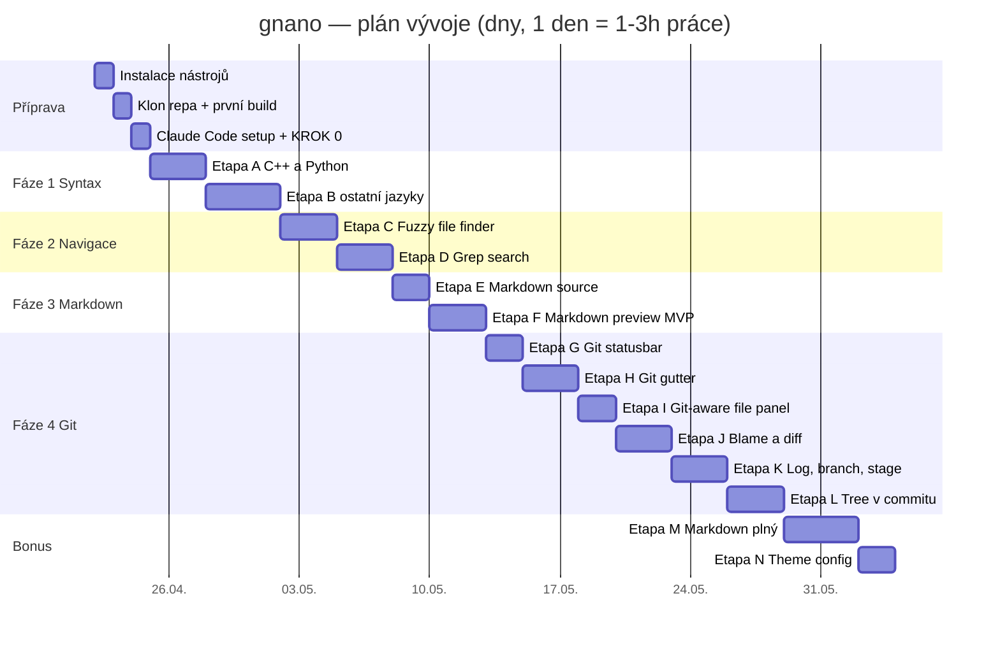

# DEVELOPMENT.md — vývojový plán projektu `gnano`

> Tento dokument je návod **krok za krokem**, co a jak dělat. Čte se od
> začátku do konce. Nic nepřeskakuj. Když něco nefunguje, najdi to v sekci
> **Záchranná brzda** dole.

---

## 0. Co budujeme (v jedné větě)

**`gnano`** — terminálový textový editor v C++17, který umí:
- barevně zvýraznit kód v 13 jazycích (C, C++, Python, JS, TS, CSS, HTML, MD, JSON, YAML, Shell, Makefile, plain)
- renderovat Markdown "hezky" (nejen zdrojově)
- ukazovat Git informace (větev, diff, blame, log, branch switch)
- fuzzy hledat soubory a grepovat napříč repem

Vychází z existujícího projektu `nano-clone`.

---

## 1. Co potřebuješ nainstalované

Na Ubuntu / Debian / WSL:

```bash
sudo apt-get update
sudo apt-get install -y \
    build-essential git \
    libncurses-dev libsqlite3-dev libgit2-dev \
    pkg-config \
    nodejs npm          # kvůli Claude Code CLI
```

**Claude Code CLI** (máš Max 5x plán, tak toho využij):
```bash
npm install -g @anthropic-ai/claude-code
claude --version    # ověření
```

Volitelně (užitečné nástroje):
```bash
sudo apt-get install -y tig lazygit delta tree htop
```

---

## 2. Příprava projektu

```bash
# Klon výchozího repa
cd ~/projects            # nebo kam chceš
git clone https://github.com/navidofek-cmyk/Vibe_Agentic_coding_robot_dreams_course_tasks.git
cd Vibe_Agentic_coding_robot_dreams_course_tasks/nano-clone

# Vytvoř si vlastní větev pro vývoj
git checkout -b feature/gnano-v1

# Ověř že původní projekt jede
make
./build/nanoclone README.md
# Esc, Ctrl+X → vypne

# Ulož si PROMPT.md a DEVELOPMENT.md do kořene projektu
cp /cesta/ke/stazenemu/PROMPT.md .
cp /cesta/ke/stazenemu/DEVELOPMENT.md .
git add PROMPT.md DEVELOPMENT.md
git commit -m "docs: plán rozšíření na gnano"
```

---

## 3. Spuštění Claude Code

V adresáři `nano-clone/`:

```bash
claude
```

Uvnitř interaktivního promptu napiš:

```
Přečti si PROMPT.md v tomto adresáři a postupuj podle něj.
Začni krokem 0 — průzkumem a návrhem.
```

Claude Code si projde soubory, vrátí ti shrnutí kódu + dva file tree
+ otázky. **Odpověz na otázky.** Pak ti řekne "mám plán, mám začít
Etapou A?" → řekneš ano → začne pracovat.

---

## 4. Gantt chart — celkový plán

Níže je časový odhad. **Reálně to bude trvat cca 2-3× déle**, začátečníci
vždycky podceňují. S tím počítej.



### Textový Gantt (pokud se ti Mermaid nezobrazí)

```
Fáze           │ Týden 1  │ Týden 2  │ Týden 3  │ Týden 4  │ Týden 5  │ Týden 6  │
───────────────┼──────────┼──────────┼──────────┼──────────┼──────────┼──────────┤
Příprava       │ ███      │          │          │          │          │          │
Syntax (A,B)   │   ███████│██        │          │          │          │          │
Navigace (C,D) │          │  ████████│          │          │          │          │
Markdown (E,F) │          │          │██████    │          │          │          │
Git (G-L)      │          │          │      ████│██████████│██████████│██        │
Bonus (M,N)    │          │          │          │          │          │  ██████  │
```

---

## 5. Etapy detailně — checklist pro každou

Každá etapa má tento workflow:

1. **Ujisti se, že main je čistá** (`git status`)
2. **Vytvoř větev** (`git checkout -b feature/etapa-X`)
3. **Spusť Claude Code**, řekni: "Pokračuj etapou X podle PROMPT.md"
4. Claude pracuje, ty čteš co dělá, kontroluješ commity
5. **Ověř build** (`make clean && make`)
6. **Manuálně otestuj** featuru na reálných souborech
7. **Merge do main** (`git checkout main && git merge feature/etapa-X`)
8. **Odškrtni v checklistu níž**
9. `/clear` v Claude Code, další etapa v novém sezení (šetří tokeny!)

### ✅ Fáze 0 — Příprava

- [ ] Nainstalované všechny závislosti
- [ ] `nano-clone` běží v původní verzi
- [ ] Vlastní větev `feature/gnano-v1`
- [ ] `PROMPT.md` a `DEVELOPMENT.md` v repu
- [ ] Claude Code nainstalovaný a funguje
- [ ] **KROK 0** proběhl: Claude popsal kód, dal file tree, odpověděl jsem na otázky

### ✅ Fáze 1 — Syntax highlighting

- [ ] **Etapa A:** Theme + factory + C++ + Python
  - [ ] Otevřeš .cpp soubor → vidíš barvy
  - [ ] Otevřeš .py soubor → vidíš barvy
  - [ ] Multi-line komentáře `/* */` fungují napříč řádky
  - [ ] Python `"""..."""` funguje napříč řádky
  - [ ] Testy procházejí
- [ ] **Etapa B:** Zbylé jazyky
  - [ ] C, JS, TS, CSS, HTML, JSON, YAML, Shell, Makefile
  - [ ] Plain text fallback (neznámá přípona)
  - [ ] Ověř na reálných souborech (otevři `/etc/nginx/nginx.conf`, `package.json`, atd.)

### ✅ Fáze 2 — Navigace a hledání

- [ ] **Etapa C:** Fuzzy file finder
  - [ ] `Ctrl+P` otevře popup
  - [ ] Píšu "edi" → najde `editor.cpp`, `editor.h`
  - [ ] CamelCase: "eH" → najde `editor.h`
  - [ ] Enter otevře v novém tabu
  - [ ] Funguje i mimo git repo
- [ ] **Etapa D:** Grep search
  - [ ] `Ctrl+T` otevře popup
  - [ ] Hledám "TODO" → vidím všechny výskyty
  - [ ] Enter otevře soubor na řádku
  - [ ] Regex přepínač funguje
  - [ ] Esc přeruší dlouhé hledání

### ✅ Fáze 3 — Markdown

- [ ] **Etapa E:** Markdown source mode
  - [ ] `.md` soubor má zvýrazněné `#`, `**`, `*`, `` ` ``, `>`, `-`
- [ ] **Etapa F:** Markdown preview mode
  - [ ] `Ctrl+P` (pozor, kolize s fuzzy finder! přejmenovat na `Ctrl+Alt+M` nebo jinak)
  - [ ] Nadpisy BOLD + barva + čára pod
  - [ ] Bold/italic markery skryté v preview
  - [ ] Odrážky nahrazeny `•`
  - [ ] Code block monochromně
  - [ ] Citace s `│`

**POZOR:** V etapě F je kolize `Ctrl+P` mezi fuzzy finder a markdown preview.
Řekni Claudovi, ať pro preview vybere jinou zkratku (třeba `Alt+P` nebo `F7`).

### ✅ Fáze 4 — Git integrace

- [ ] **Etapa G:** Git statusbar
  - [ ] V git repu vidíš větev ve statusbaru
  - [ ] Symbol `●` při neuložených změnách
  - [ ] `↑1 ↓2` vs upstream (commitnu si něco a uvidím)
  - [ ] Mimo git repo: statusbar bez git info, nic se nerozbije
- [ ] **Etapa H:** Git gutter
  - [ ] Upravím řádek → vidím `~` žlutě
  - [ ] Přidám řádek → vidím `+` zeleně
  - [ ] F5 refreshne
- [ ] **Etapa I:** Git-aware file panel
  - [ ] Modified soubory žluté `M`
  - [ ] Untracked zelené `+`
  - [ ] Ctrl+H toggluje ignored
- [ ] **Etapa J:** Blame + diff
  - [ ] `Ctrl+G B` na řádku ukáže "kdo a kdy"
  - [ ] `Ctrl+G D` otevře diff v novém bufferu
- [ ] **Etapa K:** Log + branch + stage
  - [ ] `Ctrl+G L` → seznam commitů → výběr → diff
  - [ ] `Ctrl+G C` → seznam větví → výběr → checkout
  - [ ] `Ctrl+G S` → stage/unstage
- [ ] **Etapa L:** Tree v commitu
  - [ ] `Ctrl+G T` → zadám hash → vidím strom
  - [ ] Značky +/M/-/R u souborů
  - [ ] Enter otevře historickou verzi

### ✅ Fáze 5 — Bonus

- [ ] **Etapa M:** Markdown plný (tabulky, nested listy, highlight v code)
- [ ] **Etapa N:** Theme config z `~/.config/gnano/theme.conf`

---

## 6. Workflow dne — jak vypadá jedna vývojová session

```
┌─────────────────────────────────────────────────────────┐
│ 1. ráno (15 min)                                         │
│    - git pull, git status                                │
│    - kouknu se, kde jsem skončil (tento soubor)          │
│    - vyberu si dnešní etapu                              │
├─────────────────────────────────────────────────────────┤
│ 2. vlastní práce (1-3 h)                                 │
│    - git checkout -b feature/etapa-X                     │
│    - claude                                              │
│    - "Pokračuj etapou X z PROMPT.md"                     │
│    - kontroluju co Claude dělá, čtu kód                  │
│    - po každém funkčním kroku: git commit                │
├─────────────────────────────────────────────────────────┤
│ 3. konec session (15 min)                                │
│    - make clean && make (finální ověření)                │
│    - manuální test featury                               │
│    - git merge do main, pokud je hotovo                  │
│    - aktualizuj checklist v tomto souboru                │
│    - poznámky do DIARY.md (co fungovalo, co ne)          │
└─────────────────────────────────────────────────────────┘
```

---

## 7. Správa tokenů (Max 5x plán)

Tohle je pro tebe důležité. Opus stojí hodně tokenů, Sonnet málo.

**Kdy použít který model v Claude Code:**

| Úkol | Model | Proč |
|---|---|---|
| KROK 0 (průzkum, návrh) | **Opus** | potřebuješ nejlepší plánování |
| Etapa A, B (highlightery) | **Sonnet** | mechanická práce, Sonnet stačí |
| Etapa C, D (finder, grep) | **Sonnet** | totéž |
| Etapa E, F (markdown) | **Sonnet** | totéž |
| Etapa G-L (git) | **Opus** první, pak Sonnet | git logika je zrádná, první návrh Opus, pak Sonnet implementuje |
| Debugging něčeho nefunkčního | **Opus** | těžké problémy |

**Uvnitř Claude Code:**
- `/model sonnet` → přepne na Sonnet
- `/model opus` → přepne na Opus
- `/clear` → vyčistí kontext (**dělej mezi etapami!**)
- `/compact` → shrne historii, ušetří tokeny

**Pravidlo:** jedna etapa = jedno sezení = `/clear` před další etapou.

---

## 8. Záchranná brzda — co dělat, když to nefunguje

### "Claude mi přepsal něco, co nechci"

```bash
git status               # co se změnilo
git diff                 # jak to změnilo
git checkout -- soubor   # vrátit konkrétní soubor
git reset --hard HEAD    # vrátit úplně všechno od posledního commitu
```

### "Build se rozbil"

```bash
make clean
make 2>&1 | less         # čti chyby od začátku, ne od konce
```

Dej Claudovi přesný error message, ne jen "nefunguje to".

### "Claude dělá něco jiného než chci"

Přeruš `Esc` (nebo Ctrl+C). Napiš:

```
Stop. Vrať se ke stavu před poslední změnou. Popiš, co jsi dělal, 
a počkej, než ti dám nové instrukce.
```

### "Token limit se blíží"

- `/compact` a pokračuj
- Nebo raději `/clear`, udělej commit rozpracované práce a pokračuj v novém sezení
- Nečekej až do tvrdého limitu — jinak přijdeš o rozpracovaný kontext

### "Ztratil jsem se v tom, kde jsem"

Tady je ten checklist. Aktualizuj ho po každé etapě.
A hlavně: **po každé etapě udělej commit se zprávou `feat: etapa X hotová`**
— git historie ti řekne, kde jsi.

---

## 9. Deník vývoje (volitelné, ale doporučuju)

Založ si `DIARY.md`:

```markdown
# Deník vývoje gnano

## 2026-04-22 — den 1
- Prošel jsem instalaci, build šel napoprvé
- KROK 0: Claude odhalil, že buffer je vector<string>, což je OK
- Zeptal se mě na výkon → řekl jsem "20k řádků plynule"
- Doporučil vlastní scanner pro C++ a Python, regex pro ostatní

## 2026-04-24 — den 3
- Etapa A: C++ highlighter hotový, Python z 80 %
- Problém: multi-line string v Pythonu se kazil při editaci
- Vyřešeno: line state se invaliduje od změněného řádku dolů
```

Až budeš za půl roku hledat, proč je něco napsané tak jak je, poděkuješ si.

---

## 10. Až bude hotovo

Napiš si malý README s:
- screenshotem editoru v akci (asciinema nebo screenshot terminálu)
- seznamem featur
- klávesovými zkratkami
- jak to buildovat

A zveřejni to. Je to cool projekt.

---

**Hodně štěstí! 🚀**
